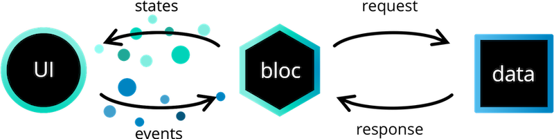

# Flutter BLoC template
This project is a template for quickly launching a Flutter application using BLoC.

## Prerequisites
### Environment
- [FVM (Flutter Version Management)](https://fvm.app/): Manages the Flutter SDK version through the `./fvm/fvm_config.json` file.

### VSCode Extensions
- [Flutter](https://marketplace.visualstudio.com/items?itemName=Dart-Code.flutter): Official extension managed by the Flutter team ;
- [bloc](https://marketplace.visualstudio.com/items?itemName=FelixAngelov.bloc): Facilitates the generation of BLoC widgets and files. Developed by the creator of BLoC ;
- [Dart Data Class Generator _(optional)_](https://marketplace.visualstudio.com/items?itemName=hzgood.dart-data-class-generator): Simplifies the creation of data models ;
- [dart-import (_optional_)](https://marketplace.visualstudio.com/items?itemName=luanpotter.dart-import): Automatically cleans up imports, converting them to relative paths ;
- [flutter-stylizer (_optional_)](https://marketplace.visualstudio.com/items?itemName=gmlewis-vscode.flutter-stylizer): Automatically formats Flutter code. _You can [customize](https://chat.openai.com/#Flutter-Stylizer) the order of objects in the options_ ;
- [Json to Dart Model (_optional_)](https://marketplace.visualstudio.com/items?itemName=hirantha.json-to-dart): Generates a document model from JSON. Useful when creating API return classes ;
- [Pubspec Dependency Search (_optional_)](https://marketplace.visualstudio.com/items?itemName=everettjf.pubspec-dependency-search): Links the `pubspec.yaml` file to the [pub.dev](https://pub.dev/) website ;
- [Flutter Intl](https://marketplace.visualstudio.com/items?itemName=localizely.flutter-intl): Manages the application's translations.

### Make sure to read theses resources
- [Effective Dart](https://dart.dev/effective-dart): Dart's best practices, all __Flutter__ project should follow them ;
- [Flutter's Perfomance & Optimization guidelines](https://docs.flutter.dev/perf): Flutter's best practices in terms of performance and optimization ;
- [BLoC's documentation](https://bloclibrary.dev/#/gettingstarted): BLoC's documentation.

## Packages used
- [`get_it`](https://pub.dev/packages/get_it): Enables dependency injection without using context ;
- [`flutter_bloc`](https://pub.dev/packages/flutter_bloc): BLoC package adapted for Flutter ;
- [`intl`](https://pub.dev/packages/intl): Provides internationalization and localization facilities, including message translation, plurals and genders, date/number formatting and parsing, and bidirectional text ;
- [`flutter_localizations`](https://pub.dev/packages/flutter_localizations): Localizations for the Flutter library ;
- [`http`](https://pub.dev/packages/http): A composable, Future-based library for making HTTP requests.

## Recommended Packages
- [`shared_preferences`](https://pub.dev/packages/shared_preferences): Manages phone shared preferences. _Shared preferences do not replace a local database_ ;
- [`isar`](https://pub.dev/packages/isar): Local database. _I prefer to use Isar because it is faster than Hive and easier to use than Sqflite_.

## How BLoC Works
The `BLoC` (or `Cubit`) replaces a "traditional" view model. It is responsible for managing the screen logic and executing calls to the data layer. Like a view model, it can be defined when used, in the `build` method of a widget. But it can also be defined globally at the app initialization using a `BlocProvider`:
```dart
// app.dart
...
    return MultiBlocProvider(
      providers: BlocSetup.globalBlocs,
      child: MaterialApp(
          // ...
          ),
    );
```

In this example, our `BLoC`s are defined in the `bloc_setup.dart` file:
```dart
// bloc_setup.dart
class BlocSetup {
  static List<BlocProvider> globalBlocs = [
    BlocProvider(create: (context) => ConnectivityCubit())
    // ...
  ];
}

```

Once defined, the `BLoC` can be retrieved using the `context`:
```dart
final bloc = context.read<ConnectivityCubit>();
// or
ConnectivityCubit bloc = context.read();
```

_It is also possible to use a `BlocProvider` in a widget to pass it to its children via the `context`. However, I prefer passing them as parameters because it makes debugging easier in case of omission, even if it complicates the screen._

### BLoC
Flutter's `BLoC` works by using a system of state (State) and events (Event) exchange.



#### BLoC
The `BLoC` is equivalent to the view model. It intercepts events (`events`), performs logic, and sends states (`states`).

#### State
States (`states`) are objects that the `BLoC` sends to the screen. They are defined in a file and all inherit from an abstract class.

#### Event
Events (`events`), like states (`states`), are objects. This time, they are sent from the screen to the `BLoC`. When the `BLoC` intercepts them, it performs logic defined by the developer and can send a state.

### Cubit
The `Cubit` is a simplified version of the `BLoC`, which does not use events to communicate but directly uses methods defined in the `Cubit`.


### Link the BLoC with the Screen
To link the BLoC _(or cubit)_ with the screen, a `BlocBuilder` is used:
```dart
...
 Widget build(BuildContext context) {
    final Cubit = HomeCubit()..init();

    return AppBody(
      title: 'Home',
      body: Padding(
        padding: const EdgeInsets.all(24.0),
        child: BlocBuilder(
          bloc: Cubit,
          builder: (BuildContext context, HomeState state) {
            // ...
          },
        ),
      ),
    );
  }
```

In the `builder` of the `BlocBuilder`, we have access to the `state` returned by the `BLoC`. Whenever a new `state` is emitted, the content of the `builder` is refreshed, so it is possible to change the display based on the `state`.
```dart
...
builder: (BuildContext context, HomeState state) {
            if (state is HomeLoadingState || state is HomeInitialState) {
              return const Center(child: CircularProgressIndicator());
            }
            if (state is HomeLoadedState) {
              return Column(
                mainAxisSize: MainAxisSize.min,
                children: [
                  Row(
                    mainAxisAlignment: MainAxisAlignment.center,
                    children: state.data.map((e) => Text(e)).toList(),
                  ),
                  const SizedBox(height: 24.0),
                  OutlinedButton(
                    onPressed: Cubit.loadMore,
                    child: const Text('Load More'),
                  ),
                ],
              );
            }
            return const Center(child: Text('Error'));
          },
...
```

### Cubit or BLoC?
BLoC is more recommended when automated tests are in place because the `State`/`Event` architecture would simplify test writing. However, Cubits are [simpler](https://chat.openai.com/#Annexes) to manage, write, and understand. I recommend using them whenever possible.


## Template Structure

```
├── assets/
├── configs/
└── lib/
    ├── config/
      └── theme/
    ├──core/
        ├── api/
        ├── constants/
        ├── global_blocs/
        ├── models/
        └── services/
    ├── helpers/
    └── ui/
      ├── components/
      ├── screens/
        └── example_screen/
          ├── components/
          ├── example_bloc/
          └── example_screen.dart
      └── ui_helpers/
```
### Root
- `assets`: Contains the application's assets, such as images, fonts, etc... ;
- `configs`: Contains the application's environment variables, such as the API URL, the application name, etc...

### Lib
- `config`: Contains the application configuration, such as the router and definition of variants (flavors)... ;
- `core`: Includes the core logic of the application, with models, services, etc... ;
- `helpers`: Contains global functions and extensions that do not interact with the user interface ;
- `ui`: Contains the visible layer of the application, where shared components, screens, and utilities related to the user interface are found.

_Note that a screen's folder includes its `BLoC`._  


## Appendices

### BLoC vs Cubit
Difference between `BLoC` and `Cubit` for the `HomeScreen` screen.

#### BLoC
```dart
// home_state.dart
part of 'home_Cubit.dart';

sealed class HomeState {}

final class HomeInitialState extends HomeState {}

final class HomeLoadingState extends HomeState {}

final class HomeLoadedState extends HomeState {
  HomeLoadedState(this.data);
  final List<String> data;
}
```

```dart
// home_event.dart
part of 'home_bloc.dart';

sealed class HomeEvent {}

final class HomeInitEvent extends HomeEvent {}

final class HomeLoadMoreEvent extends HomeEvent {}

```

```dart
// home_bloc.dartimport 'package:flutter_bloc/flutter_bloc.dart';

part 'home_event.dart';
part 'home_state.dart';

class HomeBloc extends Bloc<HomeEvent, HomeState> {
  HomeBloc() : super(HomeInitial()) {
    on<HomeInitEvent>((event, emit) async {
      emit(HomeLoadingState());
      await _homeService.getHomeData().then(
            (data) => emit(HomeLoadedState(data)),
          );
    });
    on<HomeLoadMoreEvent>((event, emit) async {
      if (state is! HomeLoadedState) return;
      final currentData = [...((state as HomeLoadedState).data)];
      emit(HomeLoadingState());
      await _homeService.getMoreData().then((data) => emit(
            HomeLoadedState([...currentData, ' ', ...data]),
          ));
    });
  }
}
```

```dart
// home_screen.dartimport 'package:flutter/material.dart';
import 'package:flutter_bloc/flutter_bloc.dart';

import '../../components/app_body.dart';
import 'home_Cubit/home_Cubit.dart';

class HomeScreen extends StatelessWidget {
  const HomeScreen({super.key});

  @override
  Widget build(BuildContext context) {
    final bloc = HomeBloc()..add(HomeInitEvent());

    return AppBody(
      title: 'Home',
      body: Padding(
        padding: const EdgeInsets.all(24.0),
        child: BlocBuilder(
            bloc: bloc,
            builder: (BuildContext context, HomeState state) {
              if (state is HomeLoadingState || state is HomeInitialState) {
                return const Center(child: CircularProgressIndicator());
              }
              if (state is HomeLoadedState) {
                return Column(
                  mainAxisSize: MainAxisSize.min,
                  children: [
                    Row(
                      mainAxisAlignment: MainAxisAlignment.center,
                      children: state.data.map((e) => Text(e)).toList(),
                    ),
                    const SizedBox(height: 24.0),
                    OutlinedButton(
                      onPressed: () {
                        bloc.add(HomeLoadMoreEvent);
                      },
                      child: const Text('Load More'),
                    ),
                  ],
                );
              }
              return const Center(child: Text('Error'));
            }),
      ),
    );
  }
}

```

#### Cubit

```dart
// home_state.dart
part of 'home_Cubit.dart';

sealed class HomeState {}

final class HomeInitialState extends HomeState {}

final class HomeLoadingState extends HomeState {}

final class HomeLoadedState extends HomeState {
  HomeLoadedState(this.data);
  final List<String> data;
}

```

```dart
// home_Cubit.dartimport 'package:flutter_bloc/flutter_bloc.dart';

import '../../../../core/services/home_service.dart';

part 'home_state.dart';

class HomeCubit extends Cubit<HomeState> {
  HomeCubit() : super(HomeInitialState());
  final _homeService = HomeService();

  Future init() async {
    emit(HomeLoadingState());
    await _homeService.getHomeData().then(
          (data) => emit(HomeLoadedState(data)),
        );
  }

  Future loadMore() async {
    if (state is! HomeLoadedState) return;
    final currentData = [...((state as HomeLoadedState).data)];
    emit(HomeLoadingState());
    await _homeService.getMoreData().then((data) => emit(
          HomeLoadedState([...currentData, ' ', ...data]),
        ));
  }
}
```

```dart
// home_screen.dart
import 'package:flutter/material.dart';
import 'package:flutter_bloc/flutter_bloc.dart';

import '../../components/app_body.dart';
import 'home_Cubit/home_Cubit.dart';

class HomeScreen extends StatelessWidget {
  const HomeScreen({super.key});

  @override
  Widget build(BuildContext context) {
    final Cubit = HomeCubit()..init();

    return AppBody(
      title: 'Home',
      body: Padding(
        padding: const EdgeInsets.all(24.0),
        child: BlocBuilder(
            bloc: Cubit,
            builder: (BuildContext context, HomeState state) {
              if (state is HomeLoadingState || state is HomeInitialState) {
                return const Center(child: CircularProgressIndicator());
              }
              if (state is HomeLoadedState) {
                return Column(
                  mainAxisSize: MainAxisSize.min,
                  children: [
                    Row(
                      mainAxisAlignment: MainAxisAlignment.center,
                      children: state.data.map((e) => Text(e)).toList(),
                    ),
                    const SizedBox(height: 24.0),
                    OutlinedButton(
                      onPressed: Cubit.loadMore,
                      child: const Text('Load More'),
                    ),
                  ],
                );
              }
              return const Center(child: Text('Error'));
            }),
      ),
    );
  }
}
```

### Flutter-Stylizer
```json
  "flutterStylizer": {
    "memberOrdering": [
      "public-constructor",
      "named-constructors",
      "private-static-variables",
      "private-instance-variables",
      "public-static-variables",
      "public-instance-variables",
      "public-override-variables",
      "public-override-methods",
      "private-other-methods",
      "public-other-methods",
      "build-method"
    ],
    "groupAndSortGetterMethods": true,
    "groupAndSortVariableTypes": true,
    "sortOtherMethods": true,
    "processEnumsLikeClasses": false,
    "sortClassesWithinFile": false
  },
```
